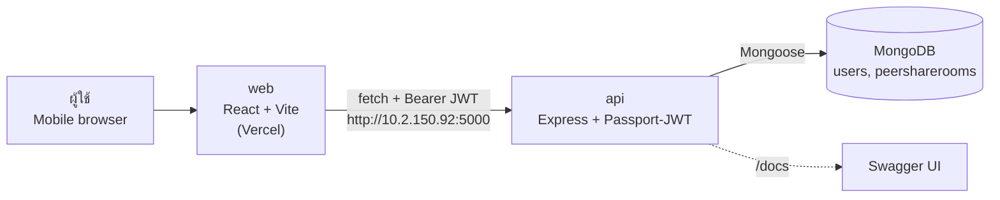
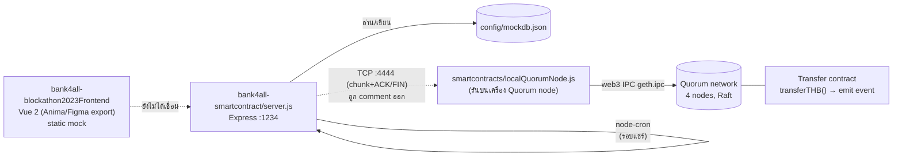
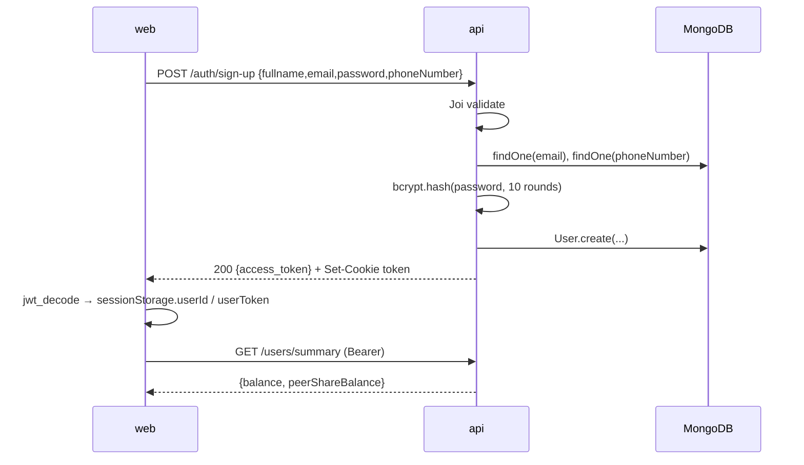
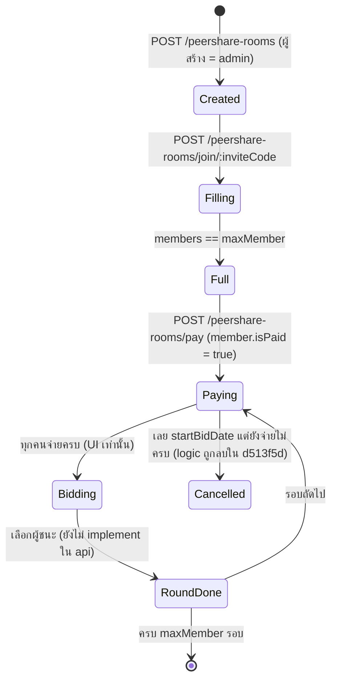

# สถาปัตยกรรมและภาพรวมระบบ

[← กลับหน้าหลัก](./README.md)

## 1. ภาพรวม

โปรเจกต์มี **2 สายการพัฒนา (tracks)** ที่แยกจากกันและไม่ได้เชื่อมต่อกัน:

| Track | ช่วงเวลา | Repos | แนวคิด |
| --- | --- | --- | --- |
| **A — Web2 MVP (Hackathon)** | มี.ค.–เม.ย. 2023 | `api`, `web` | REST API + MongoDB เก็บยอดเงินแบบ book-keeping, React web app |
| **B — Blockchain (SCB Blockathon 2023)** | 1–5 พ.ค. 2023 | `bank4all-smartcontract`, `bank4all-blockathon2023Frontend`, (`blockchain` – ว่าง) | Express + mock JSON DB, คำนวณผู้ชนะประมูล, ส่ง transaction ไป Quorum (private Ethereum) |

### Track A: Web2 MVP

- `web` เก็บ JWT ไว้ใน `sessionStorage` (`userToken`, `userId`) และส่งเป็น `Authorization: Bearer <token>`
- `api` ยัง set cookie `token=...; HttpOnly` ด้วย แต่ **ไม่ได้ใช้** ในการ auth (Passport อ่านจาก header เท่านั้น)
- เงินในระบบเป็นแค่ตัวเลขใน MongoDB (`User.balance`) — ไม่มี payment gateway จริง

### Track B: Blockathon

- การโอนเงินจริงผ่าน blockchain ถูก comment ออกในวันงาน (commit `1e13fff` — "WiFi at the venue not assign separated IP to VM")

## 2. Data flow หลัก (Track A)

### สมัคร/เข้าสู่ระบบ

### วงจรห้องแชร์ (ตามที่ออกแบบไว้)

ส่วนที่ implement จริงใน `api`: Created → Filling → Paying เท่านั้น

## 3. ไทม์ไลน์ของโปรเจกต์ (จาก git history)

| วันที่ | เหตุการณ์ |
| --- | --- |
| 2023-02-26 | สร้าง repo `bank4all` (merge/issue ยุคแรกอ้างถึงบัญชี `pleaseworkibegyou`) — init React, ร่าง Solidity `Crowdfunding` (ระบุว่าให้ ChatGPT ร่าง) |
| 2023-02-27–03-12 | ลองหลาย frontend: CRA (`my-app`), Angular (`front-end`), backend `nodeServer.js` + Docker MongoDB |
| 2023-03-10–03-14 | Issues วางแผน: #4 Peer Sharing, #11 Problem → MVP, #13 MVP Flowchart |
| 2023-03-15 | สร้าง repo `api` และ `web` แยกออกมา, ลบโค้ดใน monorepo (`1271594 move to each repo`) |
| 2023-03-22–03-26 | `api` refactor เป็น MVC + Passport-JWT, เพิ่ม transaction, peer-share room; `web` สร้างหน้าจอทั้งหมด (ช่วง hackathon) |
| 2023-03-26 | `api` commit "เฮลโล่วววว บางกอก แฮ็ค" และ "remove bid"; Issue #21 Pending Research Tasks |
| 2023-04-03 | สร้าง repo `blockchain` (private, มีแค่ LICENSE) |
| 2023-04-04 | `api` เพิ่ม Swagger + **เปลี่ยนชื่อ route** (`/user`→`/users` ฯลฯ), เพิ่ม GitHub Action TODO→Issue ทั้ง `api`/`web` |
| 2023-05-01–05-05 | Blockathon: `bank4all-smartcontract` (Express + mock DB + Quorum) และ `bank4all-blockathon2023Frontend` (Anima) |
| 2023-05-16 | อัปเดต org profile README ครั้งสุดท้าย |

## 4. ผู้ร่วมพัฒนา (ตาม git author)

| Repo | ผู้ commit หลัก |
| --- | --- |
| `bank4all` | krittakon/krit (30), Kridtin Sanardhan (10), PCep (7), Petch (5), 1tpp (5), Panapat Pilapa (5), semiangel (5), ihopethisworks (4) และอื่นๆ |
| `api` | Kittipod Lambangchang (37), Rachata Kithatthaporn (9), 1tpp (5) |
| `web` | 1tpp (28), Kittipod Lambangchang (20), Kridtin Sanardhan (12), mmenuu (11) |
| `bank4all-smartcontract` | semiangel (43) |
| `bank4all-blockathon2023Frontend` | semiangel (3) |

## 5. ลิงก์ภายนอกที่อ้างถึงในโปรเจกต์

| รายการ | ลิงก์ |
| --- | --- |
| Business Plan & Pitch Deck (Canva) | https://www.canva.com/design/DAFeSGtpxnA/P1nvqDp57HF2PghHxH4Irw/view |
| DB diagram (dbdiagram.io) | https://dbdiagram.io/d/6404ccf2296d97641d8589c7 |
| Source API spec (Google Docs) | https://docs.google.com/document/d/1CPJrx3pA0Jv5GVAcEpaOK1QWkTm8xNUX-t-2zn_s8hI/edit |
| Figma — Peer Share UI (web) | https://www.figma.com/file/Yu0nvrBNCMECjOXc4wi7rX/Debt%2FInvest?node-id=621-5414 |
| Figma — Blockathon prototype | https://www.figma.com/proto/lazUoFKRg3VZyrfaTYYy38/Blockathon?node-id=4-2 |
| Discord | https://discord.gg/QK2gtrduGc |
