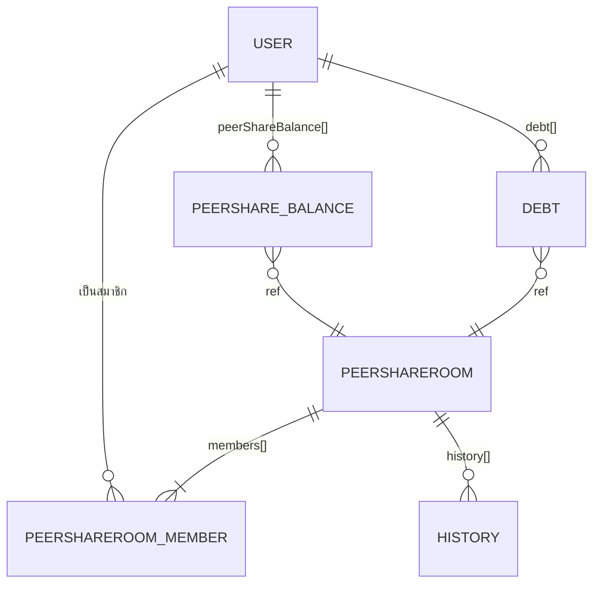

# `api` — Backend หลัก (Node.js / Express / MongoDB)

[← กลับหน้าหลัก](../README.md) · Repo: https://github.com/bankforall/api

| | |
| --- | --- |
| ภาษา | JavaScript (CommonJS) |
| Runtime | Node.js (Dockerfile ใช้ `node:16`) |
| Framework | Express 4.18 |
| Database | MongoDB ผ่าน Mongoose 7 |
| Auth | Passport + `passport-jwt` (Bearer token), `jsonwebtoken`, `bcryptjs` |
| Validation | Joi 17 |
| Docs | `swagger-jsdoc` + `swagger-ui-express` ที่ `/docs` |
| Commits | 58 (2023-03-15 → 2023-04-04) |
| Issues เปิดอยู่ | #20–#31 (สร้างอัตโนมัติจาก TODO "Add swagger documentation for …") |

## 1. โครงสร้างโฟลเดอร์

```
api/
├── server.js                    # entry point: express app, swagger, mount routes
├── config/passport.js           # JWT strategy
├── database/connect.js          # mongoose.connect(MONGO_URI)
├── constants/credit.js          # map เกรดเครดิต A–F → 5–0
├── models/
│   ├── user.model.js
│   └── peershare-room.model.js
├── routes/                      # กำหนด path + middleware passport
│   ├── auth.route.js
│   ├── user.route.js
│   ├── transaction.route.js
│   └── peershare-room.route.js
├── controllers/                 # business logic
│   ├── auth.controller.js
│   ├── user.controller.js
│   ├── transaction.controller.js
│   └── peershare-room.controller.js
├── validations/                 # Joi schemas
│   ├── auth.validation.js
│   ├── transaction.validation.js
│   └── peershare.validation.js
├── utils/
│   ├── token.js                 # generateToken(id) — JWT อายุ 1 วัน
│   ├── inviteCode.js            # 8 ตัวอักษรจาก uuid v4
│   ├── time.js                  # convertTime("1d 2h") → วินาที (import แต่ยังไม่ใช้)
│   └── credit.js                # convertCredit("A") → 5 (ยังไม่ถูกใช้)
├── docs/docs.http               # REST Client file (ล้าสมัย — path เก่าจากยุค monorepo)
├── Dockerfile, .dockerignore
├── docker-compose.yml           # backend + mongo
├── docker-compose.db.yml        # mongo อย่างเดียว
├── .github/workflows/workflow.yml  # TODO → GitHub Issue
├── .env.example
├── package.json, package-lock.json, pnpm-lock.yaml
└── LICENSE (MIT)
```

สถาปัตยกรรมเป็น **MVC แบบเบา** (ไม่มี service layer): `route → passport middleware → controller → model`

## 2. การตั้งค่าและการรัน

### Environment variables (`.env`)

| ตัวแปร | ความหมาย | ตัวอย่าง |
| --- | --- | --- |
| `PORT` | port ที่ฟัง (default `5000`) | `5000` |
| `MONGO_URI` | MongoDB connection string | `mongodb://localhost:27017/bank4all` |
| `JWT_SECRET_KEY` | secret สำหรับ sign/verify JWT | (สุ่มยาวๆ) |
| `NODE_ENV` | ประกาศไว้แต่ **ไม่ถูกใช้ในโค้ด** | `development` |

### npm scripts

| Script | คำสั่ง |
| --- | --- |
| `npm start` | `node server.js` |
| `npm run dev` | `nodemon server.js` |
| `npm test` | `jest` — **ยังไม่มีไฟล์ test** |

### Docker

```bash
# MongoDB อย่างเดียว (แล้วรัน api ด้วย npm run dev)
docker compose -f docker-compose.db.yml up -d

# ทั้ง backend + mongo — api จะอยู่ที่ http://localhost:8080
docker compose up -d --build
```

`docker-compose.yml` ตั้งค่า `JWT_SECRET_KEY=secret`, `MONGO_URI=mongodb://database:27017`, map port `8080:5000`
และ mount `./data:/data/db` (ignore ใน `.gitignore` แล้ว)

ถ้าเชื่อมต่อ MongoDB ไม่ได้ ระบบจะ `process.exit(1)`

## 3. Data Model

### `User` (collection `users`)

| Field | Type | Default / Constraint | หมายเหตุ |
| --- | --- | --- | --- |
| `fullname` | String | required | |
| `email` | String | required, **unique** | ใช้ล็อกอิน |
| `phoneNumber` | String | required, **unique** | |
| `password` | String | required | bcrypt hash (salt 10) |
| `balance` | Number | `0` | ยอดเงินในกระเป๋า (book-keeping) |
| `peerShareBalance` | `[{ peerShareRoom: ObjectId→PeerShareRoom, balance: Number }]` | | ยอดที่จ่ายเข้าแต่ละห้อง |
| `creditScore` | String | `"C"` | เกรด A–F (ยังไม่มี logic ปรับ) |
| `currentDE` | Number | `0` | D/E ratio (ยังไม่มี logic) |
| `debt` | `[{ peerShareRoom: ObjectId, amount: Number }]` | | ยังไม่มีโค้ดเขียนค่า |
| `avatar` | String | URL รูป stock | |
| `createdAt`, `updatedAt` | Date | `timestamps: true` | |

### `PeerShareRoom` (collection `peersharerooms`)

| Field | Type | Default / Constraint | หมายเหตุ |
| --- | --- | --- | --- |
| `roomName` | String | required, **unique** | |
| `paymentTerm` | Number | required | เงินต่องวดต่อคน |
| `paymentTermUnit` | String | required | ความถี่ (string อิสระ) |
| `creditRequirement` | String | required | เกรดขั้นต่ำ (ยังไม่ถูกตรวจตอน join) |
| `maxMember` | Number | required | |
| `typeRoom` | String | required, enum `Fix` \| `Float` | Joi ไม่ได้ตรวจ enum → ส่งค่าอื่นจะได้ 500 |
| `private` | Boolean | required | |
| `inviteCode` | String | unique | สร้างอัตโนมัติ |
| `roomPassword` | String | `""` | bcrypt hash ถ้า private |
| `bidTimeOut` | String | required | เช่น `"1d 2h"` |
| `startBidDate` | Date | required | **ถูกบวก 7 ชั่วโมง** ตอนสร้าง (แก้ timezone แบบ hardcode) |
| `bidRound` | Number | `1` | |
| `members[]` | sub-document | | ดูด้านล่าง |
| `history[]` | `{ round: Number=1, winner: ObjectId→User, bidRate: Number=0 }` | | ยังไม่มีโค้ดเขียนค่า |
| `createdAt`, `updatedAt` | Date | | |

`members[]`:

| Field | Type | Default |
| --- | --- | --- |
| `user` | ObjectId → User | |
| `role` | `member` \| `admin` | `member` (ผู้สร้างห้อง = `admin`) |
| `isBidden`, `isPaid`, `isWinner` | Boolean | `false` |
| `bidRate`, `interest` | Number | `0` |
| `fullname`, `credit`, `avatar`, `phoneNumber` | String | required (snapshot จาก User ตอน join) |



## 4. Authentication

- `POST /auth/sign-in` และ `/auth/sign-up` คืน `{ access_token }` (JWT payload `{ id }`, อายุ **1 วัน**)
- พร้อม set cookie `token=<jwt>; HttpOnly; Path=/; Max-Age=7200; SameSite=Strict; Secure` (2 ชม. — ไม่ตรงกับอายุ token และไม่ถูกใช้)
- Route ที่ต้อง login ใช้ `passport.authenticate("jwt", { session: false })` อ่าน token จาก header
  `Authorization: Bearer <token>` แล้ว `User.findOne({ _id: payload.id })` ใส่ใน `req.user`
- ไม่ผ่าน → `401 Unauthorized` (body เป็น text จาก passport)

## 5. API Reference

Base URL (local): `http://localhost:5000` · 🔒 = ต้องส่ง `Authorization: Bearer <token>`

ทุก error จาก validation/business ส่งเป็น `400 { "message": "..." }` และ exception เป็น
`500 { "message": "Something went wrong, please try again later" }`

### 5.1 Root & Docs

| Method | Path | คำอธิบาย |
| --- | --- | --- |
| GET | `/` | ข้อความต้อนรับ + ลิงก์ `/docs` (HTML) |
| GET | `/docs` | Swagger UI (เปิดทุก environment; ยังไม่มี path ไหนมี JSDoc จึงว่างเปล่า) |

### 5.2 Auth — `/auth`

#### `POST /auth/sign-up`

```json
{
  "fullname": "Somchai Jaidee",
  "email": "somchai@example.com",
  "password": "Passw0rd123",
  "phoneNumber": "0812345678"
}
```

Validation (Joi):
- `fullname` 3–30 ตัวอักษร
- `email` รูปแบบอีเมล
- `password` **ตัวอักษร/ตัวเลขเท่านั้น** (`/^[a-zA-Z0-9]{3,30}$/`) และยาว ≥ 8 → ผลคือ 8–30 ตัว alphanumeric
- `phoneNumber` ความยาวพอดี 10 ตัวอักษร (ไม่ได้ตรวจว่าเป็นตัวเลข)

| Status | Body |
| --- | --- |
| 200 | `{ "access_token": "<jwt>" }` |
| 400 | `Invalid data` / `User already exist` / `Phone number already exist` |

#### `POST /auth/sign-in`

```json
{ "email": "somchai@example.com", "password": "Passw0rd123" }
```

| Status | Body |
| --- | --- |
| 200 | `{ "access_token": "<jwt>" }` |
| 400 | `Invalid data` / `User not found` / `Incorrect password` |

### 5.3 Users — `/users` 🔒

#### `GET /users/profile`

```json
{
  "_id": "6420...",
  "fullname": "Somchai Jaidee",
  "email": "somchai@example.com",
  "phoneNumber": "0812345678",
  "creditScore": "C",
  "currentDE": 0,
  "balance": 1000,
  "peerShareBalance": [{ "peerShareRoom": "6421...", "balance": 500, "_id": "..." }],
  "avatar": "https://...",
  "debt": []
}
```

#### `GET /users/summary`

```json
{ "balance": 1000, "peerShareBalance": 500 }
```

`peerShareBalance` = ผลรวม `balance` จากทุกห้อง

### 5.4 Transactions — `/transactions` 🔒

ไม่มีการเชื่อม payment gateway — เป็นการบวก/ลบตัวเลข `User.balance` เท่านั้น และไม่มีการบันทึกประวัติธุรกรรม

#### `POST /transactions/deposit`

```json
{ "amount": 1000 }
```
`amount` ต้องเป็นตัวเลข ≥ 1 → `200 { "message": "deposit has been created successfully" }`

#### `POST /transactions/withdraw`

```json
{ "amount": 1000 }
```
→ `200 { "message": "withdraw has been created successfully" }` หรือ `400 Insufficient balance`

### 5.5 Peer Share Rooms — `/peershare-rooms` 🔒

#### `POST /peershare-rooms` — สร้างห้อง

```json
{
  "roomName": "วงแชร์ออฟฟิศ",
  "paymentTerm": 500,
  "paymentTermUnit": "1w",
  "creditRequirement": "C",
  "maxMember": 5,
  "typeRoom": "Float",
  "private": true,
  "roomPassword": "secret123",
  "bidTimeOut": "1d",
  "startBidDate": "2023-04-01T13:00:00Z"
}
```

- ทุก field required ยกเว้น `roomPassword` (แต่ถ้า `private: true` ต้องมี มิฉะนั้น `400 Please enter password`)
- `roomName` ซ้ำ → `400 Room already exist`
- ผู้สร้างถูกใส่เป็น member คนแรก `role: "admin"`
- สร้าง `inviteCode` อัตโนมัติ, hash `roomPassword`, บวก `startBidDate` 7 ชม.
- `200` คืน document ห้องทั้งหมด (รวม `roomPassword` hash)

#### `GET /peershare-rooms` — รายการห้องทั้งหมด

คืน array ของ `PeerShareRoom` ทุกห้อง **ทุก field** — รวม `inviteCode` และ `roomPassword` (hash) ของห้อง private

#### `GET /peershare-rooms/:id` — ห้องตาม id

`200` คืน document (หรือ `null` ถ้าไม่พบ — ไม่มี 404, id ผิดรูปแบบ → exception ไม่ถูกจับ)

#### `GET /peershare-rooms/:id/member` — สมาชิกในห้อง

`200` คืน `members[]` · `400 Room does not exist`

#### `POST /peershare-rooms/join/:inviteCode` — เข้าร่วมห้อง

```json
{ "roomPassword": "secret123" }
```

> ⚠️ Joi กำหนด `roomPassword` เป็น **required string ไม่ว่าง** แม้ห้องจะเป็น public — ต้องส่งค่าอะไรก็ได้ไป

| ผลลัพธ์ | Status | Body |
| --- | --- | --- |
| เข้าร่วมสำเร็จ | 200 | `{ "status": true }` |
| เป็นสมาชิกอยู่แล้ว | **400** | `{ "status": true }` |
| ห้องเต็ม (`members.length >= maxMember`) | 400 | `{ "status": false }` |
| ไม่พบห้อง | 400 | `{ "message": "Room does not exist" }` |
| รหัสผ่านผิด | 400 | `{ "message": "Incorrect password" }` |

ไม่มีการตรวจ `creditRequirement`

#### `POST /peershare-rooms/pay` — จ่ายเงินงวดเข้าห้อง

```json
{ "id": "<roomId>", "amount": 500 }
```

ขั้นตอน:
1. ตรวจ `user.balance >= amount` (`400 Not enough balance`)
2. ตรวจว่าห้องมีอยู่และผู้ใช้เป็นสมาชิก
3. `user.balance -= amount` และเพิ่มใน `user.peerShareBalance` ของห้องนั้น
4. ตั้ง `member.isPaid = true`
5. `200` คืน document ห้อง

ไม่ตรวจว่า `amount == paymentTerm` และไม่ใช่ transaction (2 การ save แยกกัน)
— ดูบั๊กการอัปเดต `peerShareBalance` ใน [known-issues.md](../known-issues.md#api)

### 5.6 Endpoint ที่เคยมีแต่ถูกลบ (commit `d513f5d` "feat: remove bid", 2023-03-26)

| Method | Path | หน้าที่เดิม |
| --- | --- | --- |
| PATCH | `/peershare-room/` | `biding` — stub คืน `{ message: "Biding" }` |
| GET | `/peershare-room/:id/check` | `checkForStart` — ถ้าทุกคนจ่ายครบคืน `{ readyForBid: true, ... }`; ถ้าเลย `startBidDate` แต่จ่ายไม่ครบ จะคืนเงินให้ผู้เรียกและ **ลบห้อง** |

ถ้าจะพัฒนา bidding ต่อ สามารถดูโค้ดเดิมได้ด้วย `git show d513f5d^:controllers/peershare-room.controller.js`

### 5.7 ประวัติการเปลี่ยน path (สำคัญสำหรับ `web`)

| ก่อน 2023-04-04 | หลัง commit `b1cf6ba` |
| --- | --- |
| `POST /auth/signin` | `POST /auth/sign-in` |
| `POST /auth/signup` | `POST /auth/sign-up` |
| `/user/*` | `/users/*` |
| `/transaction/*` | `/transactions/*` |
| `/peershare-room/*` | `/peershare-rooms/*` |

## 6. Utilities

| ไฟล์ | ฟังก์ชัน | พฤติกรรม |
| --- | --- | --- |
| `utils/token.js` | `generateToken(id)` | `jwt.sign({ id }, JWT_SECRET_KEY, { expiresIn: "1d" })` |
| `utils/inviteCode.js` | `generateInviteCode()` | `uuidv4()` ตัด `-` เอา 8 ตัวแรก (ไม่ได้ตรวจซ้ำ แต่ index unique จะ throw) |
| `utils/time.js` | `convertTime("1w 2d 3h")` | แปลงเป็นวินาที (`w,d,h,m,s`) |
| `utils/credit.js` | `convertCredit("B")` | คืน `4` |

## 7. CI/CD

`.github/workflows/workflow.yml` — "Run TODO to Issue" ใช้ `alstr/todo-to-issue-action@master`
รันเมื่อ push `main`/`dev`, pull request, หรือ manual → สร้าง Issue จากคอมเมนต์ `// TODO:` อัตโนมัติ
(ที่มาของ Issues #20–#31) — **ไม่มี** build/test/lint/deploy pipeline

## 8. ไฟล์อื่นที่ควรรู้

- `docs/docs.http` — ยังเป็น spec ยุค monorepo (`/signIn`, `/addMoney`, `/balanceSummary`, port 3000) ใช้ไม่ได้กับโค้ดปัจจุบัน
- มีทั้ง `package-lock.json` และ `pnpm-lock.yaml` — ควรเลือกใช้ package manager เดียว
- `package.json` ระบุ `license: ISC` แต่ไฟล์ `LICENSE` เป็น MIT
