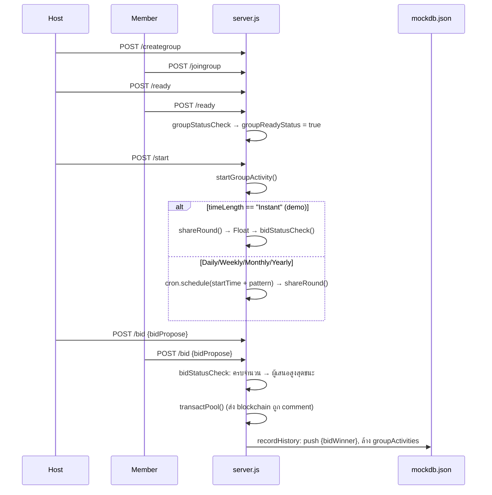

# `bank4all-smartcontract` — ROSCA backend + Smart Contract (Blockathon 2023)

[← กลับหน้าหลัก](../README.md) · Repo: https://github.com/bankforall/bank4all-smartcontract

| | |
| --- | --- |
| วัตถุประสงค์ | Backend สำหรับ **SCB Bangkok Blockathon 2023** — จัดการวงแชร์, ประมูล, และส่งธุรกรรมไป blockchain |
| ภาษา | JavaScript (Node.js), Solidity `^0.8.0` |
| Dependencies | express, body-parser, cors, jsonwebtoken, bcryptjs, dotenv, node-cron, web3 `^1.9.0` |
| Blockchain | **Quorum** (Ethereum แบบ permissioned) 4 nodes, consensus **Raft** |
| Database | `config/mockdb.json` (ไฟล์ JSON — ไม่ใช่ DB จริง) |
| Commits | 44 (2023-05-01 → 2023-05-05) เกือบทั้งหมดโดย `semiangel` |
| package.json repository | ชี้ไป `semiangel/bank4all-smartcontract` (fork ต้นทาง) |

## 1. โครงสร้างไฟล์

```
bank4all-smartcontract/
├── server.js                       # Express API ทั้งหมดอยู่ในไฟล์เดียว (port 1234)
├── config/
│   ├── config.js                   # อ่าน JWT_SECRET, DB_URI จาก .env
│   ├── db.js                       # mongoose connect (ไม่ได้ใช้, และไม่มี mongoose ใน deps)
│   └── genMockdb.js                # สร้าง mockdb.json สำหรับ dev
├── smartcontracts/
│   ├── simpleTransact.sol          # contract Transfer
│   ├── blueprintContractDeploy.js  # deploy contract ผ่าน geth IPC
│   ├── contractAddress.js          # address ที่ deploy แล้ว
│   ├── localQuorumNode.js          # TCP server บน node → เรียก contract
│   └── static-nodes.json           # enode ของ 4 nodes (192.168.1.110–113)
├── becrypTest.js                   # สคริปต์ทดสอบ bcrypt (อยู่ใน .gitignore แต่ถูก commit ไว้แล้ว)
└── package.json
```

`.gitignore` ignore: `node_modules/`, `config/mockdb.json`, `config/env/`, `.env`, `genJWT.js`, `becrypTest.js`

## 2. การรัน

```bash
npm install
echo "JWT_SECRET=<สุ่ม>" > .env

# สร้าง mock DB — สคริปต์เขียน mockdb.json ลง cwd แต่ server อ่าน config/mockdb.json
cd config && node genMockdb.js && cd ..

node server.js     # → http://localhost:1234
```

> server.js ยังสร้าง `new Web3('http://localhost:8545')` ตอนเริ่ม แต่ไม่ได้เรียกใช้ จึงรันได้โดยไม่ต้องมี node

### Mock DB (`genMockdb.js`)

- **users**: 2 บัญชีทดสอบ (`Friend` id 1, `Petch` id 2) พร้อม `passwordHash` (bcrypt) และ `walletAddr` — รหัสผ่านทดสอบถูกเขียนเป็นคอมเมนต์ในไฟล์
- **assets**: ต่อผู้ใช้ `{ name, thbBalance: 10000, btcBalance: 100, transactHistory: [] }`
- **activeGroup**: 2 วงตัวอย่าง
  - `Initial 1st group - ABC123` — `Float`, `Instant`, pool 10000 THB, 2 สมาชิก, **Private** (Petch เป็น host)
  - `Initial 2nd group - DEF456` — `Fix`, `Daily`, Public, 1 สมาชิก (Friend เป็น host)

### โครงสร้าง Group

```js
{
  id: "<sha1 ของ body ตอนสร้าง>",
  groupName: "...",
  groupReadyStatus: false,      // true เมื่อสมาชิกทุกคน ready
  groupStartedStatus: false,    // true เมื่อ host สั่ง start
  groupPolicy: {
    mainType: "Float" | "Fix",
    timeLength: "Instant" | "Daily" | "Weekly" | "Monthly" | "Yearly",
    poolSize: 10000,
    underlyingAsset: "Cash",
    maxMember: 2,
    startDate: "05052023",
    startTime: "0 0 13 ",        // ส่วนหน้าของ cron expression (sec min hour)
    collatMech: "None",
    currencyType: "THB",
    roomType: { typeName: "Private" | "Public", passwordHash?: "..." }
  },
  groupMembers:    [{ id, name, readyStatus, isHost }],
  groupActivities: [{ id, proposedBid }],   // bid ของรอบปัจจุบัน
  groupHistory:    [{ bidWinner }]          // ผู้ชนะแต่ละรอบ
}
```

## 3. API Reference (`server.js`, port 1234)

🔒 = ต้องส่ง `Authorization: Bearer <token>` (JWT ไม่มีวันหมดอายุ, payload `{ id }`)

| Method | Path | Body | การทำงาน |
| --- | --- | --- | --- |
| GET | `/` | – | `{ message: "Welcome to the API" }` |
| GET | `/greet` | – | `{ message: "Hello World!" }` |
| POST | `/login` | `{ email, password }` | ตรวจ bcrypt → `{ token }` / `401 Invalid email|password` |
| GET | `/protected` 🔒 | – | ทดสอบ token: `Hello, <name>!` |
| GET | `/dashboard` 🔒 | – | `{ assetsBalance: assets[userId], belongGroup: [groupId...] }` |
| POST | `/creategroup` 🔒 | `{ groupName, groupPolicy }` | สร้างวง (ผู้สร้าง = host) `id = sha1(JSON body)` |
| GET | `/discover` 🔒 | – | คืนทุกวง + `memberCount` |
| POST | `/joingroup` 🔒 | `{ id: groupId }` | เพิ่มตัวเองเป็นสมาชิก (ไม่ตรวจรหัสผ่าน/ห้องเต็ม/ซ้ำ) |
| POST | `/ready` 🔒 | `{ groupId }` | ตั้ง `readyStatus = true` แล้วเช็คว่าทุกคน ready หรือยัง |
| POST | `/start` 🔒 | `{ groupId }` | เฉพาะ host และวงต้อง ready → `groupStartedStatus = true` แล้วเริ่มกิจกรรม |
| POST | `/bid` 🔒 | `{ groupId, bidPropose }` | บันทึก bid ใน `groupActivities` แล้วเช็คว่าครบหรือยัง |

## 4. Flow การทำงานของวงแชร์



### Logic หาผู้ชนะ (`bidStatusCheck`)

1. `bidCount` เริ่มจากจำนวนรอบที่จบแล้ว (`groupHistory.length`) — ผู้ที่ชนะแล้วถือว่า "นับแล้ว"
2. วน `groupActivities`: ข้าม bid ของผู้ที่เคยชนะแล้ว, นับเพิ่ม, เก็บ `proposedBid` สูงสุด
3. เมื่อ `bidCount == maxMember` → ประกาศผู้ชนะ, เรียก `transactPool()` และ `recordHistory()`

Cron pattern ที่ต่อท้าย `startTime`:

| timeLength | pattern | ตัวอย่างเต็ม (`startTime = "0 0 13 "`) |
| --- | --- | --- |
| Daily | `* * *` | `0 0 13 * * *` (ทุกวัน 13:00) |
| Weekly | `* * 1` | `0 0 13 * * 1` (ทุกวันจันทร์) |
| Monthly | `1 * *` | `0 0 13 1 * *` (วันที่ 1 ทุกเดือน) |
| Yearly | `1 1 *` | `0 0 13 1 1 *` (1 ม.ค.) |

ไม่ใช่ Instant → `shareRound` จะ log "Not implemented yet..." และประเภท `Fix` ยังไม่ implement

### การโอนเงินกองกลาง (ถูกปิดไว้)

ใน `transactPool()` โค้ดที่ถูก comment จะคำนวณ `totalSumTransfer = lastRoundWinnerBid + poolSize / maxMember`
แล้ว `sendToLocalNode(fromWallet, winnerWallet, amount)`

## 5. Smart Contract

### `simpleTransact.sol`

```solidity
contract Transfer {
    event TransferCompleted(address indexed _from, address indexed _to, uint256 _value);

    function transferTHB(address _from, address _to, uint256 _value) public returns (bool) {
        require(_from != address(0), "Invalid sender address");
        require(_to != address(0), "Invalid recipient address");
        require(_value > 0, "Invalid transfer amount");
        emit TransferCompleted(_from, _to, _value);
        return true;
    }
}
```

**เป็นเพียง "บันทึก" (event log)** — ไม่มี balance/state, ไม่โอนเงินจริง, ใครเรียกก็ได้
ทำหน้าที่เป็น *digital evidence* ตามแนวคิดของโปรเจกต์

### Deployment (`blueprintContractDeploy.js`)

- เชื่อมต่อ node ผ่าน IPC `../data/geth.ipc`
- ใช้ account แรกของ node deploy ด้วย ABI + bytecode ที่ฝังในไฟล์ (compile ด้วย solc 0.8.19 ตาม metadata), gas 24,000,000
- เขียน address ลง `../config/contractAddress.js`
- address ที่ commit ไว้: `0x6965332ca9c74C4D202F01E874828CD24E5DA13c` (อยู่บน private network — ใช้ไม่ได้นอกเครือข่ายนั้น)

### Bridge: `server.js` ⇄ `localQuorumNode.js`

ออกแบบให้ `server.js` (เครื่อง backend) ส่งคำสั่งผ่าน **TCP socket** ไปยังโปรแกรมบนเครื่อง Quorum node:

| ฝั่ง | Host:Port | หน้าที่ |
| --- | --- | --- |
| `sendToLocalNode()` ใน server.js | client → `192.168.1.1:4444` | ส่ง `{A, B, C}` (from, to, value) |
| `localQuorumNode.js` | listen `:4444` | รับข้อความ, parse XML → เรียก `transferTHB(A, B, C)` |

Protocol: ส่งจำนวน chunk ก่อน → รอ `ACK` → ส่งทีละ chunk (1024 ตัวอักษร) ต่อ `ACK` → ฝั่งรับตอบ `FIN` เมื่อครบ

### Quorum network (`static-nodes.json`)

4 nodes ที่ `192.168.1.110:30300` – `192.168.1.113:30303`, raft port `53000`–`53003`, `discport=0`

## 6. สถานะ

Prototype ที่สร้างภายใน 5 วันสำหรับการแข่งขัน: flow ready → start → bid → winner ทำงานได้ในโหมด `Instant`
ส่วน blockchain ยังไม่ทำงานจริง (ปิดไว้ และมีบั๊กหลายจุด) — ดูรายการใน [known-issues.md](../known-issues.md#bank4all-smartcontract)
