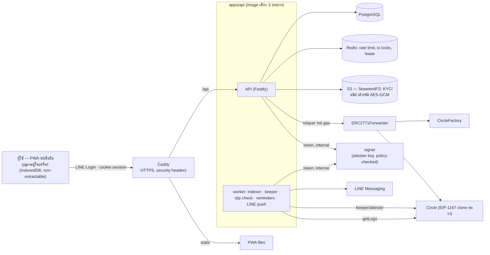
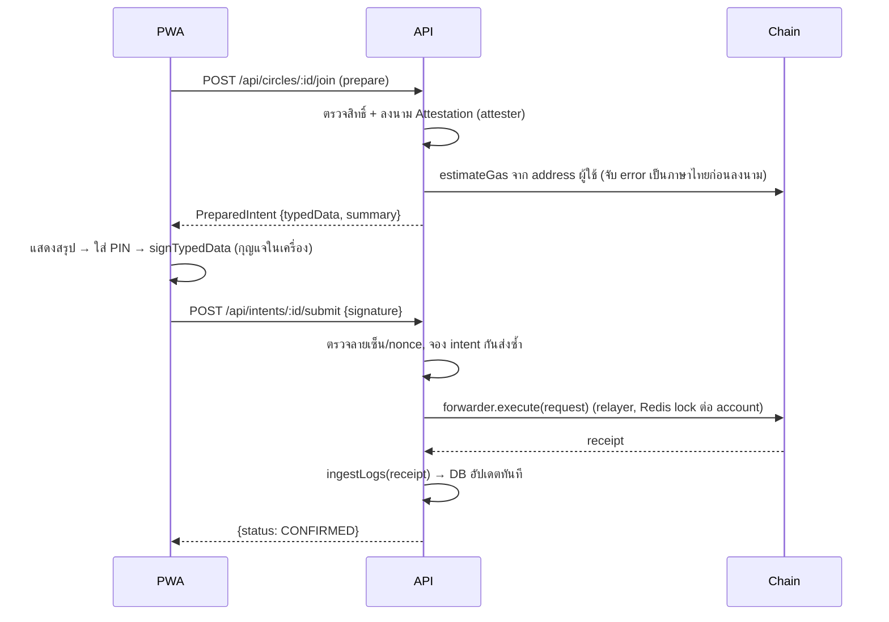

# Architecture v2 (as built)

[← v2](./README.md)

## 1. ภาพรวม

**หลักการ**
- **ไม่ถือเงิน**: สมาชิกโอนกันเองผ่าน PromptPay; contract ไม่มีฟังก์ชัน payable
- **Chain = ความจริง, DB = cache**: ตาราง Circle/Membership/Round/Payment ถูกเขียนโดย event ingester เท่านั้น (idempotent ด้วย `ChainEvent(txHash, logIndex)`) จึงสร้างใหม่จาก chain ได้เสมอ
- **ผู้ใช้ลงนามเอง**: ทุก action ของผู้ใช้เป็น EIP-712 `ForwardRequest` ที่ลงนามในเบราว์เซอร์; server ส่งผ่าน ERC-2771 forwarder และจ่าย gas → contract เห็น `_msgSender()` = ผู้ใช้ จึงปฏิเสธภายหลังไม่ได้
- **ไม่มี PII บน chain**: มีเฉพาะ address, จำนวนเงิน, เวลา และ hash (สลิป, เหตุผล dispute)
- **ผู้ใช้ไม่เห็นคำศัพท์ crypto**: ไม่มีกระเป๋า/seed phrase — มี PIN และ "รหัสกู้คืน"

## 2. โครงสร้าง `platform/`

| Path | เนื้อหา | Tests |
| --- | --- | --- |
| `packages/contracts` | `CircleFactory`, `Circle`, `CircleTypes`, deploy script, ABI export | Foundry 56 ข้อ (รวม replay test vectors, meta-tx, key rotation, regression ของ security review) + Slither 0 findings |
| `packages/shared` | กติกา (`circle-math`), zod API contract (`api.ts`), EIP-712 types, PromptPay EMVCo, ABIs | vitest 26 ข้อ (PromptPay เทียบกับ `promptpay-qr`) |
| `apps/api` | Fastify API + worker + signer + Prisma schema/migrations + CLI (image เดียว, 3 บทบาท แต่ละบทบาทได้กุญแจของตัวเองเท่านั้น) | unit 9 ข้อ + **E2E 11 ขั้น** (signer ผ่าน HTTP จริง) กับ Postgres/Redis/S3/anvil จริง |
| `apps/web` | PWA (React, Vite, Tailwind, TanStack Query, viem) | vitest 76 ข้อ (wallet crypto, ตัวตรวจก่อนลงนาม, screens) |
| `e2e` | Playwright: ผู้ใช้หลายคนในเบราว์เซอร์จริง | |
| `deploy` | `docker-compose.prod.yml`, `Caddyfile`, `.env.production.example`, `backup.sh` | smoke test ทั้ง stack แบบ production แล้ว |
| `docker-compose.dev.yml`, `scripts/dev-deploy.sh` | สภาพแวดล้อมพัฒนา | |

## 3. ลำดับการทำรายการ (intent)

## 4. Smart contract (เปลี่ยนจาก v2 draft)

| จุด | การออกแบบ |
| --- | --- |
| Meta-transactions | `ERC2771Context` ทั้ง factory และ circle; forwarder เป็น immutable ของ implementation จึงใช้ได้กับทุก clone |
| เปิดซอง | `revealBid(member, amount, salt)` — ใครถือ preimage ก็เปิดได้ (hash ผูกกับ member) → keeper เปิดให้อัตโนมัติจาก secret ที่เก็บเข้ารหัสไว้ |
| กู้คืนกุญแจ | `rotateMember(old, new, deadline, sig)` ต้องมีลายเซ็น `KeyRotation` จาก ATTESTER; ย้ายสมาชิกภาพ ที่นั่ง สถานะ และรายการรอบปัจจุบัน; ประวัติเดิมยังอยู่ใต้ address เก่า |
| เพดานกฎหมาย | `CircleFactory.setCaps` (ค่าเริ่ม 30 คน / 300,000 บาท / 3 วงต่อนายวง) |
| หยุดฉุกเฉิน | `factory.pause()` หยุดทุกวง |

API ของ contract อ่านได้จาก `packages/shared/src/abi.ts` (generate ด้วย `pnpm --filter @bankforall/contracts build`)

## 5. Worker

ทุก `WORKER_INTERVAL_MS` (worker หลายตัวได้ แต่ทำงานทีละตัวด้วย Redis lease):

1. **gas** — ตรวจยอด ETH ของ relayer/keeper/attester
2. **index** — `getLogs` จาก cursor (factory ก่อน แล้ว circles) → `ingestLogs`
3. **reconcile** — ปิด intent ที่ request หลุดก่อนได้ receipt
4. **keeper** — ใช้เวลาของ chain: เปิดซอง → `closeBidding` → `markDefault` หลังพ้นผ่อนผัน → `nextRound`; simulate ก่อนส่งทุกครั้ง
5. **slips** — ส่งสลิปให้ verifier (pluggable) ถ้าผ่าน → `attestSlip`
6. **reminders** — แจ้งเตือน D-2 / D-0 / เลยกำหนด (กันซ้ำด้วย `dedupeKey`)
7. **push** — ส่ง notification ไป LINE

## 6. ความปลอดภัย

ดูรายละเอียดและผลการตรวจความปลอดภัยใน [security.md](./security.md)

| ด้าน | มาตรการ |
| --- | --- |
| Session | JWT HS256 ใน cookie httpOnly/Secure/SameSite=Lax 30 วัน; `sessionVersion` เพิกถอนทั้งหมดได้ |
| CSRF | ทุก request ที่ไม่ใช่ GET ต้องมี header `x-requested-with: bankforall` + SameSite cookie |
| Rate limit | Redis; key ตาม session (ผู้ใช้มือถือไทยใช้ IP ร่วมกันผ่าน CGNAT) หรือ IP ถ้ายังไม่ login; OTP จำกัดต่อผู้ใช้ 5 ครั้ง/ชม. และลองรหัสได้ 5 ครั้ง |
| ข้อมูลส่วนบุคคล | ไฟล์ KYC/สลิปเข้ารหัส AES-256-GCM ก่อนเก็บ; เลขบัตรเก็บเป็น HMAC (กันหนึ่งคนหลายบัญชี) + 4 หลักท้าย; ชื่อจริงเข้ารหัส; log redact cookie/signature/salt |
| Web | CSP เข้มงวด, HSTS, frame-ancestors none; กุญแจผู้ใช้เข้ารหัสด้วย non-extractable WebCrypto key; PIN ผิด 5 ครั้งล็อก 5 นาที |
| Config | ระบบไม่เริ่มใน production ถ้า dev login เปิด, ไม่มี LINE, SMS แบบ console, ไม่ใช่ https หรือใช้กุญแจซ้ำกัน |

## 7. เวอร์ชันหลัก (ต.ค. 2026)

| ส่วน | เวอร์ชัน |
| --- | --- |
| Runtime | Node.js 24 LTS, pnpm 12 (บังคับ `minimumReleaseAge` 24 ชม. ป้องกัน supply-chain attack) |
| Contracts | Solidity 0.8.37, OpenZeppelin 5.7.0, Foundry |
| Shared/API | TypeScript 7, Zod 4, Fastify 5, Prisma 7 (`prisma-client` generator + `@prisma/adapter-pg`), viem 2, pino 10 |
| Web | React 19, React Router 8, Tailwind CSS 4, Vite 8, vite-plugin-pwa 1, TanStack Query 5 |
| Tests | Vitest 5, Playwright 1.63 |
| Infra | PostgreSQL 18, Redis 8, SeaweedFS 4.48, Caddy 2.11 |

## 8. ข้อจำกัดที่รู้แล้ว

- การตรวจสลิปอัตโนมัติยังไม่มีผู้ให้บริการ (`SLIP_VERIFIER=none`) → ผู้รับยืนยันการรับเงินเองบน chain (ซึ่งเป็นหลักฐานที่แข็งที่สุดอยู่แล้ว)
- ผู้ผิดนัดยังคงเป็นผู้รับคนสุดท้าย — ต้องตัดสินใจกติกาการชดเชย (ดู [rules-spec.md](./rules-spec.md#7-คำถามที่ยังเปิดอยู่))
- Single VPS: เหมาะกับ pilot; ขยายได้โดยแยก Postgres/Redis/S3 เป็น managed service และรัน API หลาย replica (stateless)
